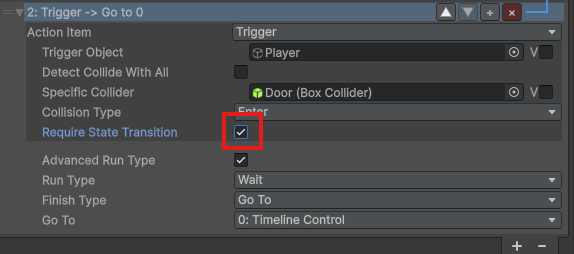

# ActionSystem Documentation

A visual, data-driven action sequencing system for Unity that allows designers to create complex game logic without writing code.

> **Screenshot placeholders** are marked with `[IMAGE: description]` throughout this document.

---

## Table of Contents

1. [Overview](#overview)
2. [Getting Started](#getting-started)
3. [Core Concepts](#core-concepts)
4. [Creating Action Sequences](#creating-action-sequences)
5. [Available Actions](#available-actions)
6. [Variable System](#variable-system)
7. [Flow Control](#flow-control)
8. [Editor Tools](#editor-tools)
9. [Creating Custom Actions](#creating-custom-actions)
10. [Limitations & Considerations](#limitations--considerations)

---

## Overview

ActionSystem is a node-based action sequencing framework that enables:

- **Visual Scripting**: Create game logic through Unity's Inspector
- **Async Execution**: Non-blocking action execution using UniTask
- **Data-Driven Design**: Separate logic from data using variables
- **Flexible Flow Control**: Conditional branching, loops, and jumps

### Architecture Diagram

```
┌─────────────────────────────────────────────────────────────┐
│                       ActionList                            │
│  (MonoBehaviour - attached to GameObject)                   │
├─────────────────────────────────────────────────────────────┤
│  ┌─────────────┐  ┌─────────────┐  ┌─────────────┐          │
│  │ Local Vars  │  │Global Vars  │  │  Actions[]  │          │
│  │ (context)   │  │(ScriptableO)│  │             │          │
│  └─────────────┘  └─────────────┘  └──────┬──────┘          │
│                                           │                 │
│         ┌─────────────────────────────────┼─────────┐       │
│         ▼                                 ▼         ▼       │
│  ┌─────────────┐              ┌─────────────┐ ┌──────────┐  │
│  │  Action[0]  │──Wait───────▶│  Action[1]  │▶│Action[2]│  │
│  │   Delay     │              │   IfElse    │ │  MoveTo  │  │
│  │  (1.0 sec)  │              │  (health>50)│ │          │  │
│  └─────────────┘              └──────┬──────┘ └──────────┘  │
│                                      │ GoTo(4)              │
│                                      ▼                      │
│                               ┌─────────────┐               │
│                               │  Action[4]  │               │
│                               │   Enable    │               │
│                               └─────────────┘               │
└─────────────────────────────────────────────────────────────┘
```

---

## Getting Started

### Step 1: Add ActionList Component

1. Select a GameObject in your scene
2. Add Component → ActionSystem → **ActionList**

> [IMAGE: images/screenshot_01_empty_actionlist.png]
> Screenshot of an empty ActionList component in the Inspector showing:
> - Run On Awake checkbox
> - Global Variables field
> - Empty Local Variables array
> - Empty Actions array

### Step 2: Add Actions

1. Expand the **Actions** array
2. Click **+** to add a new action slot
3. Click the action type dropdown to select an action

> [IMAGE: images/screenshot_02_action_dropdown.png]
> Screenshot showing the action type dropdown menu expanded with all categories:
> - Animation/ (Animator, Timeline Control)
> - Audio/ (Audio Source)
> - Logic/ (If Else, Variable)
> - Object/ (Enable Object, Move To, Collision, Trigger)
> - etc.


### Step 3: Configure Actions

Each action has its own parameters. Most parameters support two modes:
- **Direct Value**: A fixed value you set
- **Variable Reference**: Points to a local or global variable

> [IMAGE: images/screenshot_03_action_configured.png]
> Screenshot of an expanded ActionDelay showing:
> - Run Type dropdown set to "Delay"
> - Duration field with Value/Variable toggle
> - The direct value field showing "1.5"


### Step 4: Run the Sequence

- **Automatic**: Enable "Run On Awake" checkbox
- **Manual**: Call `actionList.Run()` from code or use "Run Manually" button in editor

---

## Core Concepts

### Actions

Actions are the building blocks of sequences. Each action:
- Performs a single task (wait, move, play sound, etc.)
- Can be **Wait** (blocking) or **NotWait** (fire-and-forget)
- Returns success/failure status

### Run Types

| Run Type | Description |
|----------|-------------|
| **Wait** | Waits for action to complete before proceeding |
| **NotWait** | Fires action and immediately continues |
| **Skip** | Skips this action entirely |

### Finish Types (Advanced)

| Finish Type | Description |
|-------------|-------------|
| **Continue** | Proceed to next action (default) |
| **Stop** | Halt the entire sequence |
| **Pause** | Pause until manually resumed |
| **GoTo** | Jump to a specific action index |

---

## Creating Action Sequences

### Example: Door Opening Sequence

> [IMAGE: images/screenshot_16_door_example.png]
> Screenshot of a complete door opening sequence in the Inspector showing all 6 actions configured


### Example: Health-Based Animation
[IMAGE: images/screenshot_17_health_example.png]


---

## Available Actions

### Animation

| Action | Description |
|--------|-------------|
| **ActionAnimator** | CrossFade to animation state with optional wait |
| **ActionTimeline** | Control PlayableDirector (Play/Pause/Stop/Resume) |

### Audio

| Action | Description |
|--------|-------------|
| **ActionAudioSource** | Control AudioSource (Play/Pause/Stop/Volume fade) |

### Object

| Action | Description |
|--------|-------------|
| **ActionEnableObject** | Enable/disable GameObject |
| **ActionMoveTo** | Tween position/rotation/scale using DOTween |
| **ActionTrigger** | Wait for trigger events (Enter/Exit/Stay) |
| **ActionCollision** | Wait for collision events (Enter/Exit/Stay) |

### Logic

| Action | Description |
|--------|-------------|
| **ActionIfElse** | Conditional branching with comparison operators |
| **ActionVariable** | Get/Set/Modify variable values |
| **ActionLists** | Call other ActionLists |

### Utility

| Action | Description |
|--------|-------------|
| **ActionDelay** | Wait for specified duration |
| **ActionSetEvent** | Invoke UnityEvent |
| **ActionDebugLog** | Log messages to console |
| **ActionComment** | Non-executing comment for documentation |

---

## Variable System

### Local Variables

Variables scoped to a single ActionList. Perfect for:
- Temporary state
- Action-specific data
- Loop counters

> [IMAGE: images/screenshot_04_local_variables.png]
> Screenshot of the Local Variables array expanded showing:
> - Multiple variables with different types (Float, Boolean, GameObject)
> - Variable names and their values
> - Type dropdown for each variable


### Global Variables

Variables shared across multiple ActionLists via ScriptableObject:

1. Create: Assets → Create → ActionSystem → **GlobalVariables**
2. Assign to ActionList's "Global Variables" field
3. Reference in actions using "Global" toggle

> [IMAGE: images/screenshot_18_create_global_variables.png]
> Screenshot showing the Unity Create menu expanded:
> - Assets → Create → ActionSystem → GlobalVariables

### Variable Types

| Type | Description |
|------|-------------|
| **GameObject** | Reference to scene objects |
| **Component** | Reference to any component |
| **Integer** | Whole numbers |
| **Float** | Decimal numbers |
| **Boolean** | True/false flags |
| **String** | Text data |

### Reference System

Actions use "Ref" types that can be either direct values or variable references:

> [IMAGE: images/screenshot_05_ref_value_mode.png]
> Screenshot showing a FloatRef field in "Value" mode with direct input

> [IMAGE: images/screenshot_06_ref_variable_mode.png]
> Screenshot showing a FloatRef field in "Variable" mode with:
> - Local/Global toggle
> - Variable name dropdown


---

## Flow Control

### Sequential Execution (Default)

Actions run one after another:

```
[Action 0] ──▶ [Action 1] ──▶ [Action 2] ──▶ [Action 3]
```

### Conditional Branching (If/Else)

> [IMAGE: images/screenshot_07_ifelse_action.png]
> Screenshot of ActionIfElse expanded showing:
> - Left value and Right value fields
> - Comparison operator dropdown (>, <, ==, etc.)
> - True branch settings (Continue/Stop/GoTo)
> - False branch settings (Continue/Stop/GoTo)


### GoTo Jumps

Jump to any action by index:

```
[Action 0] ──▶ [Action 1] ──▶ [Action 2]
                                  │
                                  │ GoTo: 0
                                  ▼
                    ┌─────────────────────────┐
                    │ (loops back to Action 0)│
                    └─────────────────────────┘
```

### Require State Transition (Collision/Trigger)

For collision and trigger actions, enable "Require State Transition" to:
- **Exit detection**: Only trigger if Enter happened first
- **Enter detection**: Only trigger if Exit happened first

This prevents false detections when objects start in certain states.


> Screenshot of ActionTrigger showing:
> - Trigger Object reference
> - Collision Type dropdown (Enter/Exit/Stay)
> - Require State Transition checkbox
> - Specific Collider field (when not detecting all)

---

## Editor Tools

### Inspector Features

> [IMAGE: images/screenshot_08_full_inspector.png]
> Screenshot of a complete ActionList inspector showing:
> - Top toolbar (Expand All, Collapse All, Show GoTo Arrows, Flow Window button)
> - Multiple actions in the list
> - GoTo arrows connecting actions
> - Run Manually button at bottom

> [IMAGE: images/screenshot_09_goto_arrows.png]
> Screenshot highlighting the GoTo arrow visualization:
> - Blue arrows for regular GoTo
> - Green arrows for If/Else true branch
> - Red arrows for If/Else false branch


### Action Controls

> [IMAGE: images/screenshot_15_action_buttons.png]
> Screenshot highlighting the action control buttons (▲ ▼ + ×) in the action header

> [GIF: images/gif_02_drag_reorder.gif]
> Animated GIF showing drag-and-drop reordering of actions with visual drop indicator

| Button | Function |
|--------|----------|
| **▲** | Move action up |
| **▼** | Move action down |
| **+** | Duplicate action |
| **×** | Delete action |

### Visual Indicators

> [IMAGE: images/screenshot_10_running_action.png]

| Indicator | Meaning |
|-----------|---------|
| Green background | Action currently running |
| Gray background | Action skipped |
| Blue arrow | GoTo target |
| Green arrow | If/Else true branch |
| Red arrow | If/Else false branch |
| Red square | Stop finish type |

### Flow Window

Open via "Flow Window" button for a visual node graph:


> - Multiple action nodes connected with lines
> - Branching paths from If/Else node
> - Different colored connections (gray=normal, green=true, red=false, blue=goto)

> - Currently executing node highlighted with green border
> - Completed nodes vs pending nodes

> [GIF: images/gif_01_flow_window_interaction.gif]
> Animated GIF showing:
> - Dragging nodes to reposition
> - Panning with middle mouse
> - Zooming with scroll wheel


**Controls:**
- **Drag nodes** to reposition
- **Middle-mouse drag** to pan
- **Scroll** to zoom
- **Double-click node** to select in Inspector

---

## Creating Custom Actions

### Basic Template

```csharp
using System;
using Cysharp.Threading.Tasks;
using UnityEngine;

namespace ActionSystem
{
    [Serializable]
    [ActionMenuPath("Category/My Action")]
    public class ActionMyAction : ActionItemBase
    {
        [SerializeField] private GameObjectRef _target;
        [SerializeField] private FloatRef _duration;
        [SerializeField] private BoolRef _enabled;

        public override async UniTask<bool> Run()
        {
            // Get values from references (supports both direct and variable)
            var target = _target.GetValue(Context);
            var duration = _duration.GetValue(Context);
            var enabled = _enabled.GetValue(Context);

            if (target == null) return true;

            // Your action logic here
            target.SetActive(enabled);
            await Awaitable.WaitForSecondsAsync(duration);

            return true; // Return false to halt sequence
        }
    }
}
```

### With Init/Cleanup

```csharp
[Serializable]
[ActionMenuPath("Events/My Listener")]
public class ActionMyListener : ActionItemBase
{
    [SerializeField] private ComponentRef<MyComponent> _component;

    private MyComponent _resolved;
    private bool _triggered;

    public override void Init()
    {
        _triggered = false;
        _resolved = _component.GetValue(Context);
        if (_resolved != null)
            _resolved.OnEvent += HandleEvent;
    }

    public override void Cleanup()
    {
        if (_resolved != null)
            _resolved.OnEvent -= HandleEvent;
    }

    private void HandleEvent() => _triggered = true;

    public override async UniTask<bool> Run()
    {
        await UniTask.WaitUntil(() => _triggered);
        return true;
    }
}
```

### With Custom Display Name

```csharp
[Serializable]
[ActionMenuPath("Debug/Custom Log", 0.8f, 0.4f, 0.4f, 1f)] // With color
public class ActionCustomLog : ActionItemBase
{
    [SerializeField] private StringRef _message;
    [SerializeField] private LogType _logType = LogType.Log;

    public override void Validate(int index)
    {
        base.Validate(index);
        Name = $"Log ({_logType}): {_message.GetDisplayName()}";
    }

    public override async UniTask<bool> Run()
    {
        var message = _message.GetValue(Context);
        Debug.unityLogger.Log(_logType, message);
        return true;
    }
}
```

### Reference Types Available

| Type | Usage |
|------|-------|
| `GameObjectRef` | `_ref.GetValue(Context)` → GameObject |
| `TransformRef` | `_ref.GetValue(Context)` → Transform |
| `ComponentRef<T>` | `_ref.GetValue(Context)` → T (component) |
| `IntRef` | `_ref.GetValue(Context)` → int |
| `FloatRef` | `_ref.GetValue(Context)` → float |
| `BoolRef` | `_ref.GetValue(Context)` → bool |
| `StringRef` | `_ref.GetValue(Context)` → string |

---

## Limitations & Considerations

### Technical Limitations

| Limitation | Description |
|------------|-------------|
| **No Undo for Runtime Changes** | Variable modifications during play mode are not tracked by Unity's undo system |
| **Serialization Constraints** | Actions use `[SerializeReference]` which has Unity version requirements (2019.3+) |
| **No Multi-Object Editing** | ActionList inspector doesn't support editing multiple selected objects |
| **GoTo Index Fragility** | Reordering actions can break GoTo references (editor tries to auto-fix) |

### Performance Considerations

| Consideration | Recommendation |
|---------------|----------------|
| **Many Actions** | Large sequences (100+) may slow down inspector rendering |
| **Frequent Variable Access** | Cache resolved values in `Init()` for performance-critical actions |
| **Collision/Trigger Actions** | Uses listeners that persist; call `Cleanup()` when done |
| **DOTween Usage** | Tweens are not automatically killed; may need manual cleanup |

### Design Considerations

| Consideration | Description |
|---------------|-------------|
| **Debugging Complexity** | Complex branching can be hard to follow; use Flow Window |
| **No Breakpoints** | Cannot pause at specific actions like traditional debuggers |
| **Limited Error Handling** | Actions return bool; no detailed error information |
| **Single Thread** | All actions run on main thread; heavy operations should use async |

### When NOT to Use ActionSystem

- **Performance-Critical Code**: Frame-sensitive operations (physics, rendering)
- **Complex Algorithms**: Better suited for traditional C# code
- **Network Code**: Requires proper async handling beyond simple sequences
- **AI Behavior Trees**: Consider dedicated behavior tree solutions instead

### Best Practices

1. **Keep Actions Focused**: One action = one responsibility
2. **Use Variables for Reusability**: Don't hardcode values in actions
3. **Comment Complex Sequences**: Use ActionComment for documentation
4. **Test Incrementally**: Use "Run Manually" frequently during development
5. **Name Variables Clearly**: Index-based lookup is fast but name provides clarity
6. **Prefer Local Variables**: Use global only when truly needed across sequences

---

## Dependencies

- **UniTask** (Cysharp.Threading.Tasks) - Async/await support
- **DOTween** - Tweening animations
- **NaughtyAttributes** - Enhanced inspector attributes

---

## Version Compatibility

- Unity 2019.3+ (for SerializeReference support)
- Unity 2022+ recommended (for Awaitable support)

---
